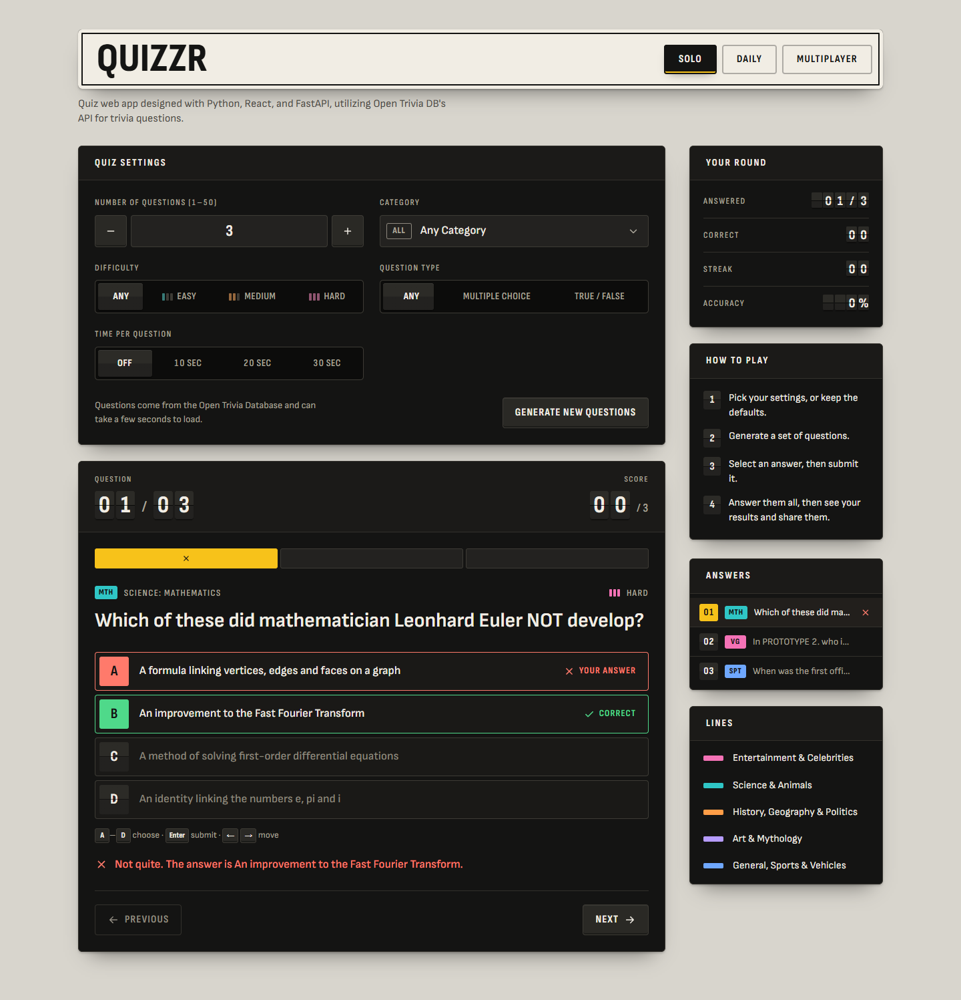
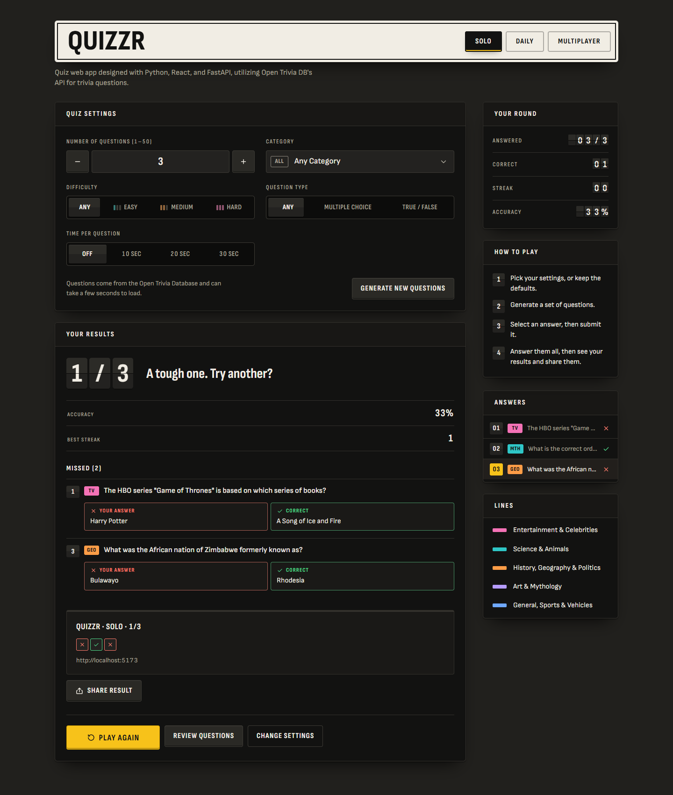
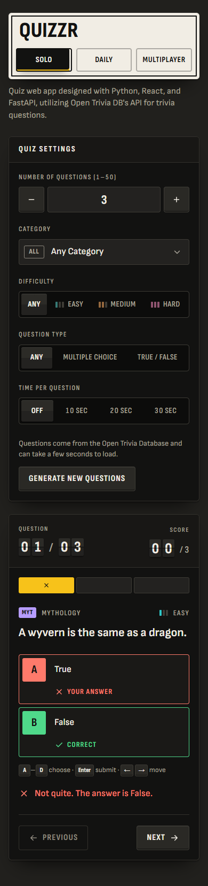
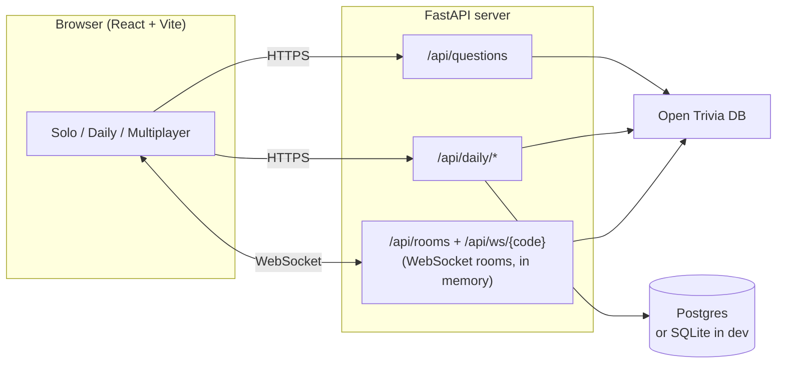

# Quizzr

**Trivia on a departure board.** Play solo, take the daily challenge against everyone else, or open a live multiplayer room and share a five-letter code. No accounts, no install.

[](https://github.com/jacobchen08/Quiz-App/actions/workflows/ci.yml)

Built with React 19 + Vite on the front, FastAPI with WebSockets on the back, and questions from the [Open Trivia Database](https://opentdb.com/).

<p align="center">
  
</p>

<p align="center">
  
  &nbsp;
  
</p>

## What you can do

- **Solo:** choose the number of questions, category, difficulty, question type and an optional time limit. Pick an answer, then submit it. The round ends on a results board with every question you missed and a result you can share.
- **Daily challenge:** the same ten questions for everyone each day, one attempt each. The server checks every answer, and the leaderboard ranks by correct answers, then time.
- **Multiplayer:** create a room and share the code or invite link. The host picks the settings and everyone sees them live. Scoring is 100 points per correct answer plus up to 50 for speed, and the leaderboard updates as people answer.
  - With a **time limit**, the game runs in lockstep: one question at a time for everyone, closed by the server's clock.
- **Rejoin after a dropped connection.** If your phone switches apps or you reload mid-game, you're put back in your seat with your answers and score.
- **Play from the keyboard.** `A`–`D` choose, `Enter` submits, the arrow keys move between questions, and the mode tabs follow the ARIA tabs pattern.

## Architecture



In production the frontend is a static site on a CDN and the API is a separate Docker service (see [`render.yaml`](render.yaml)), so the page loads instantly even while the free-tier API is waking up.

## Design decisions

- **The server checks every answer.** The browser never receives a correct answer before the player has answered that question. In multiplayer and the daily challenge, correct answers stay on the server, so nobody can read them from dev tools. Solo play is only against yourself, so it checks answers in the browser.
- **Seats are held instead of dropped.** A WebSocket that closes without saying "leave" keeps its seat for 90 seconds. The browser reconnects with a per-tab token and gets its answers back. Losing your place because your phone switched apps is the most common way a real-time game feels broken.
- **Timed games run on the server's clock.** Each state message includes the server's time, so every browser counts down to the same deadline. Answers that arrive after it (with a little network grace) are refused, and the speed bonus is measured from when each question opened.
- **One daily attempt per browser, without accounts.** A random token in `localStorage` identifies a player. Someone could get another attempt by clearing their storage. For a casual game that trade is better than making people sign up, and the leaderboard only lists finished runs.
- **One database layer, two backends.** The daily challenge's SQL runs on both SQLite, with zero setup for development, and Postgres, which survives restarts in production. CI runs the tests against both.
- **Built for everyone.** The target is WCAG 2.2 AA. Right and wrong always carry a glyph and a word, never colour alone. Motion respects reduced-motion settings, live changes are announced to screen readers, and automated axe checks run on every push, in light and dark mode.

## Run it locally

You need Python 3.12+ and Node 22+.

```bash
# API on http://localhost:8000
cd backend
pip install -r requirements.txt
uvicorn apicall:app --reload --port 8000
```

```bash
# App on http://localhost:5173 (forwards /api to port 8000)
cd my-react-app
npm install
npm run dev
```

## Tests

| Suite | Command | What it covers |
| --- | --- | --- |
| Backend | `pip install -r backend/requirements-dev.txt` then `python -m pytest backend` | Question fetching and retries, multiplayer rooms (scoring, streaks, held seats, timed lockstep, shared settings), the daily challenge, rate limits |
| Frontend | `npm test` (in `my-react-app`) | Components and scoring helpers, including keyboard play and timed states |
| End-to-end | `npm run test:e2e` (in `my-react-app`) | Real browsers: a keyboard-played solo round, a timed question, the daily challenge, a two-player timed game with a reload mid-game, and WCAG 2.2 AA checks in light and dark |

The end-to-end suite starts its own API and dev server on separate ports, with Open Trivia DB swapped for predictable offline questions (`QUIZZR_OFFLINE_TRIVIA=1`). Locally it uses the installed Microsoft Edge. In CI it uses Playwright's Chromium.

[GitHub Actions](.github/workflows/ci.yml) runs all of it on every push, with the daily-challenge tests run a second time against a real Postgres.

## Deploy

[`render.yaml`](render.yaml) is a Render Blueprint for two services. Create them with **New → Blueprint** on [render.com](https://render.com).

| Setting | Where | Purpose |
| --- | --- | --- |
| `DATABASE_URL` | `quizzr-api` | A Postgres connection string, e.g. from a free [Neon](https://neon.tech) database. Without it, the daily leaderboard uses SQLite and resets whenever the server restarts. |
| `ALLOWED_ORIGINS` | `quizzr-api` | Filled in automatically with the static site's address |
| `VITE_API_HOST` | `quizzr` | Filled in automatically with the API's address |

The [`Dockerfile`](Dockerfile) also works on its own as a single service that serves both the API and the built app.

The API logs one JSON line per request and per game event, and rate-limits by IP address. The limits cover creating rooms, fetching questions, daily answers and WebSocket messages.

## Project layout

```
backend/
  apicall.py       FastAPI app: questions, CORS, request logging, static files
  multiplayer.py   WebSocket rooms: seats, scoring, streaks, timed lockstep
  daily.py         Daily challenge endpoints and leaderboard
  database.py      Postgres / SQLite connection layer
  trivia.py        Open Trivia DB client (with retry on rate limits)
  ratelimit.py     Per-IP limits
  logs.py          Structured JSON logs
  tests/
my-react-app/
  src/             App, Solo, Daily, Multiplayer and their components
  e2e/             Playwright end-to-end and accessibility tests
docs/              Screenshots for this README
```

## Credits

Questions come from the [Open Trivia Database](https://opentdb.com/), licensed [CC BY-SA 4.0](https://creativecommons.org/licenses/by-sa/4.0/). The typeface is [Sofia Sans](https://github.com/lettersoup/Sofia-Sans), under the SIL Open Font License.
