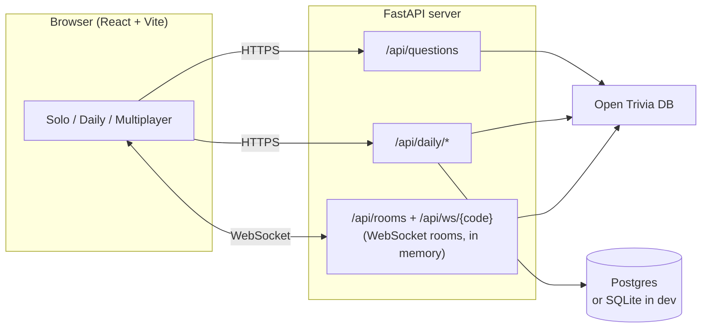

# Quizzr

**Trivia on a departure board.** Play solo, take the daily challenge against everyone else, or open a live multiplayer room and share a five-letter code. No accounts, no install.

[](https://github.com/jacobchen08/Quiz-App/actions/workflows/ci.yml)

Built with React 19 + Vite on the front, FastAPI with WebSockets on the back, and questions from the [Open Trivia Database](https://opentdb.com/).

<p align="center">
  
</p>

<p align="center">
  
  &nbsp;
  
</p>

## What you can do

- **Solo:** choose the number of questions, category, difficulty, question type and an optional time limit. Pick an answer, then submit it. The round ends on a results board with every question you missed and a result you can share.
- **Daily challenge:** the same ten questions for everyone each day, one attempt each. The server checks every answer, and the leaderboard ranks by correct answers, then time.
- **Multiplayer:** create a room and share the code or invite link. The host picks the settings and everyone sees them live. Scoring is 100 points per correct answer plus up to 50 for speed, and the leaderboard updates as people answer.
  - With a **time limit**, the game runs in lockstep: one question at a time for everyone, closed by the server's clock.
- **Rejoin after a dropped connection.** If your phone switches apps or you reload mid-game, you're put back in your seat with your answers and score.
- **Works offline.** After one visit the app opens without a connection, and solo keeps playing from a pack of questions saved in the browser. The daily challenge and multiplayer say plainly that they need a connection.
- **Play from the keyboard.** `A`–`D` choose, `Enter` submits, the arrow keys move between questions, and the mode tabs follow the ARIA tabs pattern.

## Architecture



In production the frontend is a static site on a CDN and the API is a separate Docker service (see [`render.yaml`](render.yaml)), so the page loads instantly even while the free-tier API is waking up.

## Design decisions

- **The server checks every answer.** The browser never receives a correct answer before the player has answered that question. In multiplayer and the daily challenge, correct answers stay on the server, so nobody can read them from dev tools. Solo play is only against yourself, so it checks answers in the browser.
- **Seats are held instead of dropped.** A WebSocket that closes without saying "leave" keeps its seat for 90 seconds. The browser reconnects with a per-tab token and gets its answers back. Losing your place because your phone switched apps is the most common way a real-time game feels broken.
- **Timed games run on the server's clock.** Each state message includes the server's time, so every browser counts down to the same deadline. Answers that arrive after it (with a little network grace) are refused, and the speed bonus is measured from when each question opened.
- **One daily attempt per browser, without accounts.** A random token in `localStorage` identifies a player. Someone could get another attempt by clearing their storage. For a casual game that trade is better than making people sign up, and the leaderboard only lists finished runs.
- **One database layer, two backends.** The daily challenge's SQL runs on both SQLite, with zero setup for development, and Postgres, which survives restarts in production. CI runs the tests against both.
- **Built for everyone.** The target is WCAG 2.2 AA. Right and wrong always carry a glyph and a word, never color alone. Motion respects reduced-motion settings, live changes are announced to screen readers, and automated axe checks run on every push, in light and dark mode.

## Run it locally

You need Python 3.12+ and Node 22+.

```bash
# API on http://localhost:8000
cd backend
pip install -r requirements.txt
uvicorn main:app --reload --port 8000 --no-access-log
```

```bash
# App on http://localhost:5173 (forwards /api to port 8000)
cd frontend
npm install
npm run dev
```

## Tests

| Suite | Command | What it covers |
| --- | --- | --- |
| Backend | `pip install -r backend/requirements-dev.txt` then `python -m pytest backend` | Question fetching and retries, multiplayer rooms (scoring, streaks, held seats, timed lockstep, shared settings), the daily challenge, rate limits |
| Frontend | `npm test` (in `frontend`) | Components and scoring helpers, including keyboard play and timed states |
| End-to-end | `npm run test:e2e` (in `frontend`) | Real browsers: a keyboard-played solo round, a timed question, the daily challenge, a two-player timed game with a reload mid-game, offline play, and WCAG 2.2 AA checks in light and dark |

The end-to-end suite starts its own API and dev server on separate ports, with Open Trivia DB swapped for predictable offline questions (`QUIZZR_OFFLINE_TRIVIA=1`). Locally it uses the installed Microsoft Edge. In CI it uses Playwright's Chromium.

[GitHub Actions](.github/workflows/ci.yml) runs all of it on every push, with the daily-challenge tests run a second time against a real Postgres.

## Deploy

[`render.yaml`](render.yaml) is a Render Blueprint for two services. Create them with **New → Blueprint** on [render.com](https://render.com).

| Setting | Where | Purpose |
| --- | --- | --- |
| `DATABASE_URL` | `quizzr-api` | A Postgres connection string, e.g. from a free [Neon](https://neon.tech) database. Without it, the daily leaderboard uses SQLite and resets whenever the server restarts. |
| `ALLOWED_ORIGINS` | `quizzr-api` | Filled in automatically with the static site's address |
| `VITE_API_HOST` | `quizzr` | Filled in automatically with the API's address |

The [`Dockerfile`](Dockerfile) also works on its own as a single service that serves both the API and the built app.

The API logs one JSON line per request and per game event, and rate-limits by IP address. The limits cover creating rooms, fetching questions, daily answers and WebSocket messages.

## Project layout

Two apps live side by side: `backend/` is the API server (Python), `frontend/` is the web page (React). They talk over HTTP and, for multiplayer, a WebSocket.

```
backend/                     The API server (FastAPI). Run it with: uvicorn main:app
  main.py                    Starts here: builds the app and plugs in every route below
  trivia.py                  Fetches questions from Open Trivia DB; prepares them for play
  multiplayer.py             Live rooms over WebSockets: seats, scoring, streaks, timed games
  daily.py                   The daily challenge: today's questions, answers, leaderboard
  database.py                Talks to Postgres (production) or a SQLite file (development)
  ratelimit.py               Limits how often one visitor can call each endpoint
  logs.py                    Writes one JSON line per request or game event
  tests/                     pytest tests, one file per module above

frontend/                    The web page (React + Vite)
  index.html                 The page shell: title, icons, link previews
  vite.config.js             Build setup: dev proxy to the API, the offline service worker
  playwright.config.js       How the end-to-end tests start a throwaway API and app
  public/                    Files served as they are: icons, the web app manifest, link preview image
  e2e/                       End-to-end tests: real browsers playing each mode, plus accessibility checks
  src/
    main.jsx                 Starts here: loads the styles, draws <App>, registers the service worker
    App.jsx                  The whole page: the sign and mode tabs, the three modes, the side boards

    modes/                   One folder per tab. Each owns its state and talks to the server.
      solo/Solo.jsx            Settings, a round of questions, results. Works offline too.
      daily/Daily.jsx          Today's challenge: start, answer (checked by the server), results
      daily/DailyLeaderboard.jsx   Today's finishers
      multiplayer/Multiplayer.jsx  A live room: the WebSocket, reconnecting, lobby, game, results
      multiplayer/JoinRoom.jsx     Your name, then create a room or type a code to join one
      multiplayer/RoomLeaderboard.jsx  The players in a room, ranked as they score

    components/              Pieces of the screen shared by the modes
      QuestionCard.jsx         One question: readouts, answer rows, feedback, keyboard play
      ResultsBoard.jsx         The end of a round: score, stats, missed questions, share
      ShareResult.jsx          The shareable result slip and its Share button
      Settings.jsx             Quiz settings: the form, the fold-away toggle, the read-only summary
      SideBoards.jsx           Boards beside the quiz on wide screens: Answers, Lines, Your round, How to play
      FlapText.jsx             Text on split-flap tiles that flip when it changes
      WakeBanner.jsx           "Waking the server up" notice for slow requests
      OfflineBanner.jsx        "You're offline" notice
      Icon.jsx, RouteBadge.jsx, Pips.jsx   Small drawn pieces: icons, category badges, difficulty bars

    hooks/                   Reusable React behaviour
      useOnline.js             Whether the browser is online
      usePersistentFlag.js     An on/off choice remembered in this browser
      useBringIntoView.js      Scrolls a new round's first question into view
      useFlipList.js           Slides leaderboard rows to their new places
      useIndicator.js          Measures the selected tab or option so its highlight can slide to it

    lib/                     Plain JavaScript, no React: the logic, easy to test on its own
      api.js                   Where the API is, and the calls the modes make to it
      serverStatus.js          fetch with a time limit, and tracking of slow requests
      questions.js             Decodes and shuffles Open Trivia DB questions for solo play
      results.js               Streaks, verdicts, share text and other scoring helpers
      categories.js            Categories and difficulties, with their line colours and codes
      offlinePack.js           The questions saved in this browser for playing offline
      storage.js               Everything kept in browser storage, read and written safely
      seat.js                  Your seat in a multiplayer room, kept for this tab
      flapDrum.js              Which characters a flap tile passes through, and how fast
      motion.js                Whether the visitor asked for reduced motion

    styles/                  The look. index.css loads the rest in order (later files win).
      tokens.css               Every colour, font, radius and curve (see DESIGN.md)
      base.css                 Fonts, resets and the page column
      motion.css               Animations shared across the app
      layout.css               The sign, the mode tabs and where boards sit on the page
      board.css, buttons.css, flaps.css, lines.css   The building blocks
      settings.css, messages.css, question.css, side-boards.css, results.css   Parts of the screen
      leaderboard.css, multiplayer.css, daily.css   Mode-specific pieces

    test/setup.js            Prepares the simulated browser the unit tests run in

  *.test.js(x) files sit next to the code they test.

docs/                        Screenshots for this README
DESIGN.md                    The design system: colours, type, components, rules
PRODUCT.md                   Who the app is for and the constraints it works within
Dockerfile                   Builds the API (and the app) into one container
render.yaml                  Hosting setup on Render: a static site plus the API
.github/workflows/ci.yml     Runs every test on every push
```

**Following one answer through the code.** In the daily challenge, clicking an answer and pressing Submit calls `onAnswer` in `components/QuestionCard.jsx`. That runs `answer()` in `modes/daily/Daily.jsx`, which sends it to the server with `daily.answer()` from `lib/api.js`. On the server, `answer_daily()` in `backend/daily.py` checks it, stores it through `database.py`, and replies with whether it was right. Back in the browser, the reply updates the question card and the side boards.

## Credits

Questions come from the [Open Trivia Database](https://opentdb.com/), licensed [CC BY-SA 4.0](https://creativecommons.org/licenses/by-sa/4.0/). The typeface is [Sofia Sans](https://github.com/lettersoup/Sofia-Sans), under the SIL Open Font License.
